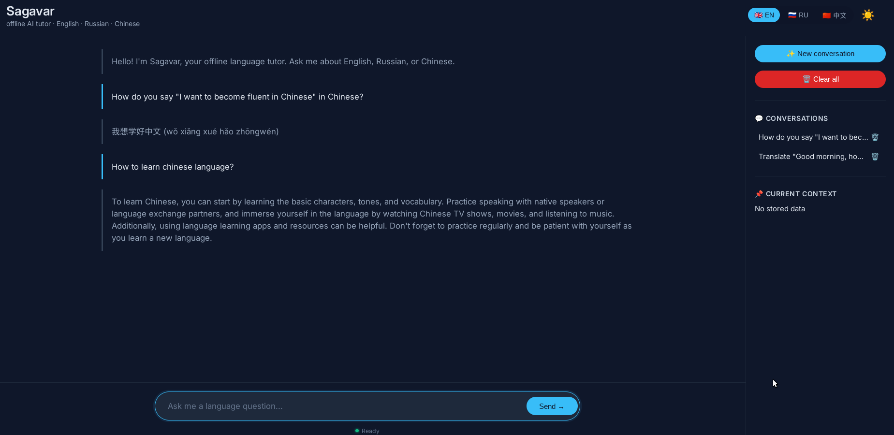

# Sagavar - Offline Language Tutor

## Requirements

- Linux (ALT Linux, Ubuntu, Debian, etc.)
- 4 GB RAM (8 GB recommended)
- 5 GB free disk space
- Python 3 (usually pre-installed; if not: `sudo apt install python3`)
- Internet connection only for the initial download of the model and KoboldCpp

**Note**: This project is under active development. Future versions will include improved model support (e.g., Qwen 3B, fine-tuned Russian models) and better handling of complex grammar and idioms.

## Known limitations
- The **Qwen 2.5 1.5B** quantized model may make mistakes in advanced Russian grammar and Chinese idioms.
- For complex questions (proverbs, grammar differences), the assistant might give incorrect answers or ask to rephrase.
- Recommended use: basic translations, conversation practice, and simple vocabulary.

---

## 🇬🇧 English

### What you need to download separately

- **KoboldCpp** (AI server): download the Linux version `koboldcpp-linux-x64-nocuda` from the latest release page:  
  [https://github.com/LostRuins/koboldcpp/releases/latest](https://github.com/LostRuins/koboldcpp/releases/latest)  
  Place the file inside the `Sagavar` folder.

- **Language model** (GGUF file): visit the official Hugging Face page and download the **Q4_0** version (file `Qwen2.5-1.5B-Instruct-Q4_0.gguf`):  
  [https://huggingface.co/bartowski/Qwen2.5-1.5B-Instruct-GGUF](https://huggingface.co/bartowski/Qwen2.5-1.5B-Instruct-GGUF)  
  Place the downloaded file inside the `Sagavar` folder.

### How to start Sagavar

1. **Download this repository** (click the green "Code" button → "Download ZIP") and extract it on your Desktop. You will get a folder named `Sagavar`.
2. **Download KoboldCpp and the model** as explained above, and put both files into the `Sagavar` folder.
3. **Make the script executable**: right-click on `avvia_sagavar.sh` → **Properties** → **Permissions** → check **"Allow executing file as program"**.
4. **Double-click** `avvia_sagavar.sh`. If asked, choose **"Run in Terminal"**.
5. **Wait about 10 seconds** – your browser will open with the Sagavar interface.
6. **Start chatting** (e.g. `Say 'hello' in Chinese`).
7. **To quit**: close the browser, then press `Ctrl+C` in the terminal window.

> If the browser does not open automatically, go to [http://localhost:8000/sagavar.html](http://localhost:8000/sagavar.html)

### Troubleshooting

- **Python not found**: install Python 3 with `sudo apt install python3`.
- **KoboldCpp fails to start**: make sure the file is executable (right-click → Properties → Permissions → check "Allow executing as program").
- **Model not found**: ensure the `.gguf` file is inside the `Sagavar` folder and the filename matches exactly.

---

## 🇷🇺 Русский

### Что нужно скачать отдельно

- **KoboldCpp**: скачайте версию для Linux `koboldcpp-linux-x64-nocuda` со страницы последних выпусков:  
  [https://github.com/LostRuins/koboldcpp/releases/latest](https://github.com/LostRuins/koboldcpp/releases/latest)  
  Поместите файл в папку `Sagavar`.

- **Языковая модель**: зайдите на официальную страницу Hugging Face и скачайте версию **Q4_0** (файл `Qwen2.5-1.5B-Instruct-Q4_0.gguf`):  
  [https://huggingface.co/bartowski/Qwen2.5-1.5B-Instruct-GGUF](https://huggingface.co/bartowski/Qwen2.5-1.5B-Instruct-GGUF)  
  Поместите скачанный файл в папку `Sagavar`.

### Как запустить Sagavar

1. **Скачайте этот репозиторий** (зелёная кнопка "Code" → "Download ZIP") и распакуйте на Рабочем столе. Получите папку `Sagavar`.
2. Скачайте KoboldCpp и модель, как указано выше, и положите их в папку `Sagavar`.
3. Сделайте скрипт исполняемым: правой кнопкой по `avvia_sagavar.sh` → Свойства → Права → отметьте «Разрешить запуск файла как программы».
4. Дважды щёлкните по `avvia_sagavar.sh`. При запросе выберите «Запустить в терминале».
5. Подождите около 10 секунд – откроется браузер с интерфейсом Sagavar.
6. Вводите вопросы (например `Say 'hello' in Chinese`).
7. Чтобы выйти: закройте браузер, затем нажмите `Ctrl+C` в окне терминала.

> Если браузер не открывается, перейдите по адресу [http://localhost:8000/sagavar.html](http://localhost:8000/sagavar.html)

### Решение проблем

- **Python не найден**: установите Python 3 командой `sudo apt install python3`.
- **KoboldCpp не запускается**: убедитесь, что файл имеет права на выполнение (правой кнопкой → Свойства → Права → отметьте «Разрешить запуск файла как программы»).
- **Модель не найдена**: проверьте, что файл `.gguf` находится внутри папки `Sagavar` и имя файла совпадает.

---

## 🇨🇳 中文

### 需要单独下载的组件

- **KoboldCpp**（AI服务器）：从最新发布页面下载 Linux 版本 `koboldcpp-linux-x64-nocuda`：  
  [https://github.com/LostRuins/koboldcpp/releases/latest](https://github.com/LostRuins/koboldcpp/releases/latest)  
  将文件放入 `Sagavar` 文件夹。

- **语言模型**（GGUF 文件）：访问 Hugging Face 官方页面，下载 **Q4_0** 版本（文件 `Qwen2.5-1.5B-Instruct-Q4_0.gguf`）：  
  [https://huggingface.co/bartowski/Qwen2.5-1.5B-Instruct-GGUF](https://huggingface.co/bartowski/Qwen2.5-1.5B-Instruct-GGUF)  
  将下载的文件放入 `Sagavar` 文件夹。

### 如何启动 Sagavar

1. **下载本仓库**（绿色 "Code" 按钮 → "Download ZIP"）并解压到桌面。你将得到一个 `Sagavar` 文件夹。
2. 按照上述说明下载 KoboldCpp 和模型，并将它们放入 `Sagavar` 文件夹。
3. 使脚本可执行：右键点击 `avvia_sagavar.sh` → 属性 → 权限 → 勾选“允许作为程序执行文件”。
4. 双击 `avvia_sagavar.sh`。如果询问，选择“在终端中运行”。
5. 等待约 10 秒 – 浏览器将打开 Sagavar 界面。
6. 开始提问（例如 `Say 'hello' in Chinese`）。
7. 退出：关闭浏览器，然后在终端窗口中按 `Ctrl+C`。

> 如果浏览器没有自动打开，请访问 [http://localhost:8000/sagavar.html](http://localhost:8000/sagavar.html)

### 故障排除

- **未找到 Python**：运行 `sudo apt install python3` 安装 Python 3。
- **KoboldCpp 无法启动**：确保文件具有可执行权限（右键点击 → 属性 → 权限 → 勾选“允许作为程序执行文件”）。
- **未找到模型**：确保 `.gguf` 文件在 `Sagavar` 文件夹内，并且文件名完全匹配。
